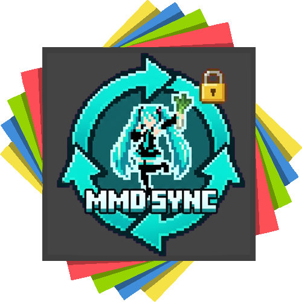

<p align="center">
  
</p>

**MmdSkin-Bukkit** 是 [MC-MMD-rust](https://github.com/shiroha-233/MC-MMD-rust) 模组的 Bukkit/Spigot 插件端实现。

它负责在插件服务端上为玩家之间同步 MMD 模型、动画、物理状态和表情，使得安装了模组的玩家能够在插件服上互相看到对方的 MMD 形象和动作。

## 功能特性

- **模型与动作同步**: 实时同步玩家的 MMD 模型选择、动画播放、表情（Morph）以及物理状态。
- **资源同步服务**: 支持玩家直接从游戏内上传模型和动作包。
- **跨版本支持**: 配合 ViaVersion 等插件，可让 1.20.1 和 1.21.1 等不同版本的客户端玩家相互可见。
- **安全与加密**: 实时加密，确保服务器模型资源在传输和在客户端存储过程中的安全。
- **高性能**: 纯 Bukkit API 实现，支持异步分块处理与 GZIP 压缩，对服务器性能影响极小。

## 客户端说明

由于插件整合了多项功能，客户端需要根据需求安装对应的 Mod：

1. **基础模型显示 (必选)**:
   - 需安装 [MC-MMD-rust](https://github.com/shiroha-233/MC-MMD-rust) 。这是看到他人模型的基础。
2. **便捷同步功能 (可选)**:
   - 需安装 [MMDSync](https://github.com/XUANHLGG/MMDSkinSync) 模组。
   - **资源上传**: 安装后可在模型选择界面点击“上传模型资源”按钮，通过系统文件对话框直接将本地模型上传至服务器。
   - **自动同步**: 玩家进入服务器时，模组会自动从服务器下载缺失的模型或动作文件（增量更新），无需手动分发资源包。

> [!NOTE]
> - 如果不安装 [MMDSync](https://github.com/XUANHLGG/MMDSkinSync) 模组，玩家仍可看到他人模型，但无法使用游戏内直接上传及自动同步功能（需手动将模型文件分发给玩家并放入指定目录）。
> - 如果玩家未安装以上任何模组，仍可正常进入服务器游玩，只是无法看到 Mmd 模型。

## 安装与配置

1. 从 [Releases](https://github.com/opdent-cmd/MmdSkin-Bukkit/releases) 下载最新版本。
2. 放入服务器 `plugins` 文件夹并重启。
3. 在生成的 `config.yml` 中配置：
   - `sync.enabled`: 是否启用同步服务。
   - `sync.enableGzip`: 是否开启 GZIP 压缩。
   - `security.serverSecret`: 服务器私密盐（首次启动自动生成，请勿泄露）。
   - `debug.enabled`: 调试模式开关，用于排查转发问题。

## 构建

```bash
./gradlew build
```

## 许可证

MIT License
